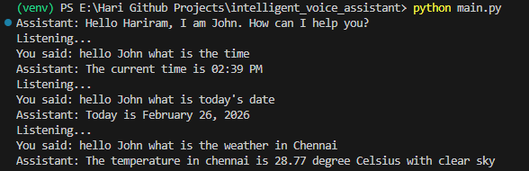

# Intelligent Voice Assistant – Python Project

A modular voice-controlled assistant built using Python. It can perform basic smart assistant tasks like opening websites, playing YouTube videos, searching Wikipedia, telling time/date, and more.

### This project demonstrates:

- Speech Recognition
- Text-to-Speech
- Command Handling
- Modular Python Architecture

## Features

- Wake word detection (e.g., "Hello John")
- Play songs directly on YouTube
- Open websites (Google, YouTube, etc.)
- Wikipedia search (Who is / What is / Explain)
- Tell current time
- Tell today's date
- Tell weather (if implemented)
- Exit using voice command
- Clean modular folder structure

## Project Structure

intelligent_voice_assistant/
│
├── command_engine/
│   └── command_handler.py
│
├── speech_engine/
│   ├── recognizer.py
│   └── speaker.py
│
├── config.py
├── main.py
├── requirements.txt
└── README.md

## How It Works

- The assistant listens using SpeechRecognition.
- Converts speech → text.
- Detects wake word.
- Processes command using command_handler.py.
- Responds using pyttsx3 (Text-to-Speech).
- Executes actions like opening browser, YouTube, Wikipedia, etc.

## Technologies Used

- Python 3
- SpeechRecognition
- pyttsx3 (Text-to-Speech)
- pywhatkit (YouTube automation)
- wikipedia (Search API)
- webbrowser (Open websites)
- datetime (Time & Date) 

## How to Run

Make sure Python is installed.

### Clone the Repository
- git clone https://github.com/YOUR_USERNAME/intelligent_voice_assistant.git

### Navigate to Project Folder
cd intelligent_voice_assistant

### Create Virtual Environment (Recommended)
python -m venv venv
venv\Scripts\activate

### Install Dependencies
pip install -r requirements.txt

### Run the Assistant
python main.py

## Example Commands

- "Hello John open Chrome"
- "Hello John play Song on YouTube"
- "Hello John who is Abdul Kalam"
- "Hello John Explain is Flutter"
- "Hello John what is the time"
- "Hello John exit"

## Future Improvements

- GUI interface (Tkinter / Custom UI)
- Continuous listening mode
- Spotify integration
- Weather API integration
- AI chatbot integration (OpenAI API)
- Convert to .exe application
- Natural language understanding (NLTK / spaCy)

## Learning Outcomes

This project demonstrates:

- Python project structuring
- Modular programming
- Working with external libraries
- Voice automation concepts
- Event-driven command handling

## Preview

### Created by [Hariram](https://github.com/Hariram47)